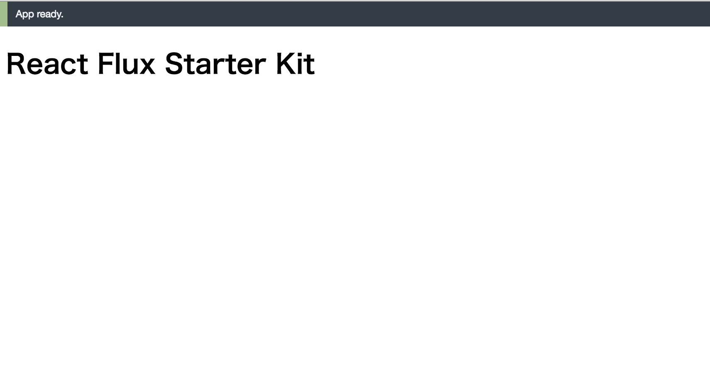

# React + Flux Starter Kit

React + Flux でアプリーケーションを作成するための雛形です。

## セットアップ

```sh
$ npm install
$ npm start
```

下記にアクセスすると画像のような画面が表示されます。開発中はファイル変更でリビルドおよびライブリロードが行われます。

[http://localhost:8080](http://localhost:8080)



